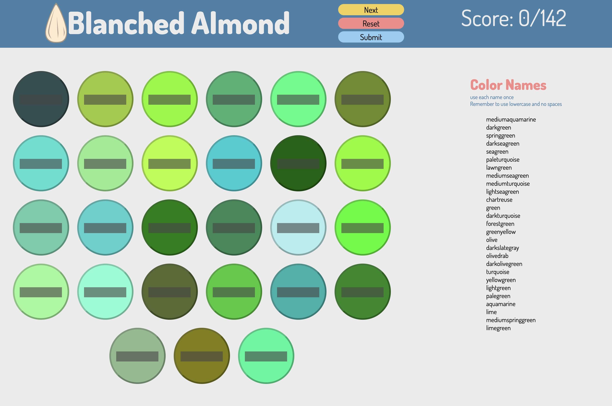

# Blanched Almond

## 
A color matching game for the 147 known colors you can call in css.

## Motivation

I wanted to build a game that would test and sharpen the players knowledge of the known color names you can call in CSS design. The player will be able to retake the quiz and try to improve on their high score.

---

## 

## User Story & Wireframes

- The player will arrive to the game with a blank stage
- Once "Start" is clicked, the stage will be loaded with the current color level
- There is a total of 10 color level that increase in difficulty as you progress
  - the levels were based of color family sets from [147 Colors](http://www.colors.commutercreative.com/grid/)
    - Cyan - 5 colors
    - Orange - 6 colors
    - Pink - 6 colors
    - Red - 10 colors
    - Yellow - 10 colors
    - Brown - 15 colors
    - Blue - 17 colors
    - Purple - 19 colors
    - Green - 27 colors
    - Gray - 27 colors
- The possible answers will be displayed on the right of the screen
- Each color has an input box for the player to type their guess
- Once the player had filled in their answers, they will click "Submit"
- The player's inputs are now check against the correct answers, and the score will be updated
- The score will increase 1 point for each correct answer
- Any incorrect answers will be grayed out
- Now, when the player hits start, they the next level will load with new colors and answers
- Once the player progresses through all 10 levels, it will notify the player the game is over and provide their final score.

---

## Technologies & Code Snippets

- HTML
- Javascript
- CSS/Sass

```js
    buildStage () {
        for (let i = 0; i < currentLevel.length; i++) {

            const createColorBox = document.createElement('div')
            createColorBox.style.backgroundColor = currentLevel[i]
            createColorBox.setAttribute('class', 'colorBox')
            createColorBox.setAttribute('id', 'colorBox')
            levelContainer.appendChild(createColorBox)

            //Adds an input box ontop of the colorbox div
            let guessBox = document.createElement('input')
            guessBox.setAttribute('type', 'text')
            guessBox.setAttribute('class', 'answerInput')
            guessBox.setAttribute('id', 'answerInput')
            createColorBox.appendChild(guessBox)
        }

    }
```

```js
    const checkScore = () => {
        let playerAnswers = document.querySelectorAll('.answerInput')
        let correctAnswers = document.querySelectorAll('.colorBox')
        or (let i = 0; i < correctAnswers.length; i++) {
            if (playerAnswers[i].value === correctAnswers[i].style.backgroundColor) {
                playerScore++
            } else if (playerAnswers[i].value !== correctAnswers[i].style.backgroundColor) {
                playerAnswers[i].style.color = 'rgba(255, 255, 255, 0.4)'
            }
            document.getElementById('playerScoreContainer').innerHTML = `Score: ${playerScore}`
        }

    }
```

---

## Credits

- [147 Colors](http://www.colors.commutercreative.com/grid/)

---

## Current State and Future Development

[Live Site - Blanched Almond](https://brockmolmen.github.io/blanched-almond/)

- Responsive design
- Mobile layout - switches to a vertical alignment
- add modals for instructions and game over
- feature that strikes-through color name options onces they have been used as a guess
- Sumbit button deactivated until all guesses filled out
